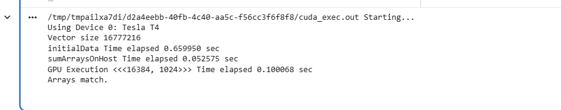
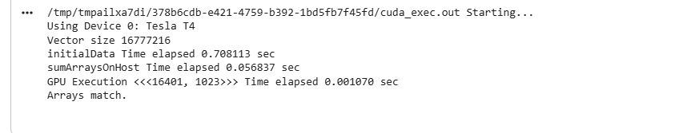
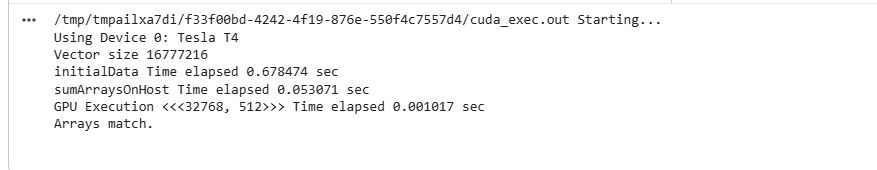
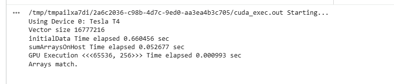

# PCA: EXP-1  SUM ARRAY GPU
<h3>NAME : HARISHKUMAR R</h3>
<h3>REG-NO : 212223230073</h3>
<h3>EX. NO : 1</h3>
<h3>DATE : 16-05-26</h3>
<h1> <align=center> SUM ARRAY ON HOST AND DEVICE </h3>
PCA-GPU-based-vector-summation.-Explore-the-differences.
i) Using the program sumArraysOnGPU-timer.cu, set the block.x = 1023. Recompile and run it. Compare the result with the execution configuration of block.x = 1024. Try to explain the difference and the reason.

ii) Refer to sumArraysOnGPU-timer.cu, and let block.x = 256. Make a new kernel to let each thread handle two elements. Compare the results with other execution confi gurations.
## AIM:

To perform vector addition on host and device.

## EQUIPMENTS REQUIRED:
Hardware – PCs with NVIDIA GPU & CUDA NVCC
Google Colab with NVCC Compiler


## PROCEDURE:

1. Initialize the device and set the device properties.
2. Allocate memory on the host for input and output arrays.
3. Initialize input arrays with random values on the host.
4. Allocate memory on the device for input and output arrays, and copy input data from host to device.
5. Launch a CUDA kernel to perform vector addition on the device.
6. Copy output data from the device to the host and verify the results against the host's sequential vector addition. Free memory on the host and the device.

## PROGRAM:
```
%%cuda
#include <stdio.h>
#include <stdlib.h>
#include <sys/time.h>
#include <time.h>
#include <cuda_runtime.h>

#ifndef _COMMON_H
#define _COMMON_H

#define CHECK(call)                                                            \
{                                                                              \
    const cudaError_t error = call;                                            \
    if (error != cudaSuccess)                                                  \
    {                                                                          \
        fprintf(stderr, "Error: %s:%d, ", __FILE__, __LINE__);                 \
        fprintf(stderr, "code: %d, reason: %s\n", error,                       \
                cudaGetErrorString(error));                                    \
        exit(1);                                                               \
    }                                                                          \
}

inline double seconds()
{
    struct timeval tp;
    gettimeofday(&tp, NULL);
    return ((double)tp.tv_sec + (double)tp.tv_usec * 1.e-6);
}

#endif

void checkResult(float *hostRef, float *gpuRef, const int N)
{
    double epsilon = 1.0E-8;
    bool match = 1;

    for (int i = 0; i < N; i++)
    {
        if (fabs(hostRef[i] - gpuRef[i]) > epsilon)
        {
            match = 0;
            printf("Arrays do not match!\n");
            printf("host %5.2f gpu %5.2f at index %d\n",
                   hostRef[i], gpuRef[i], i);
            break;
        }
    }

    if (match) printf("Arrays match.\n\n");
}

void initialData(float *ip, int size)
{
    time_t t;
    srand((unsigned) time(&t));

    for (int i = 0; i < size; i++)
    {
        ip[i] = (float)(rand() & 0xFF) / 10.0f;
    }
}

void sumArraysOnHost(float *A, float *B, float *C, const int N)
{
    for (int i = 0; i < N; i++)
    {
        C[i] = A[i] + B[i];
    }
}

// ================= DEVICE KERNEL =================
__global__ void sumArraysOnGPU(float *A, float *B, float *C, int N)
{
    int i = blockIdx.x * blockDim.x + threadIdx.x;

    if (i < N)
    {
        C[i] = A[i] + B[i];
    }
}
// =================================================


int main(int argc, char **argv)
{
    printf("%s Starting...\n", argv[0]);

    int dev = 0;
    cudaDeviceProp deviceProp;
    CHECK(cudaGetDeviceProperties(&deviceProp, dev));
    printf("Using Device %d: %s\n", dev, deviceProp.name);
    CHECK(cudaSetDevice(dev));

    int nElem = 1<<24;
    printf("Vector size %d\n", nElem);

    size_t nBytes = nElem * sizeof(float);

    float *h_A, *h_B, *hostRef, *gpuRef;
    h_A     = (float *)malloc(nBytes);
    h_B     = (float *)malloc(nBytes);
    hostRef = (float *)malloc(nBytes);
    gpuRef  = (float *)malloc(nBytes);

    double iStart, iElaps;

    iStart = seconds();
    initialData(h_A, nElem);
    initialData(h_B, nElem);
    iElaps = seconds() - iStart;
    printf("initialData Time elapsed %f sec\n", iElaps);

    memset(hostRef, 0, nBytes);
    memset(gpuRef,  0, nBytes);

    iStart = seconds();
    sumArraysOnHost(h_A, h_B, hostRef, nElem);
    iElaps = seconds() - iStart;
    printf("sumArraysOnHost Time elapsed %f sec\n", iElaps);

    float *d_A, *d_B, *d_C;
    CHECK(cudaMalloc((float**)&d_A, nBytes));
    CHECK(cudaMalloc((float**)&d_B, nBytes));
    CHECK(cudaMalloc((float**)&d_C, nBytes));

    CHECK(cudaMemcpy(d_A, h_A, nBytes, cudaMemcpyHostToDevice));
    CHECK(cudaMemcpy(d_B, h_B, nBytes, cudaMemcpyHostToDevice));

    int blockSize = 1024;
    int gridSize  = (nElem + blockSize - 1) / blockSize;

    iStart = seconds();
    sumArraysOnGPU<<<gridSize, blockSize>>>(d_A, d_B, d_C, nElem);
    CHECK(cudaDeviceSynchronize());
    iElaps = seconds() - iStart;

    printf("GPU Execution <<<%d, %d>>> Time elapsed %f sec\n",
           gridSize, blockSize, iElaps);

    CHECK(cudaMemcpy(gpuRef, d_C, nBytes, cudaMemcpyDeviceToHost));

    checkResult(hostRef, gpuRef, nElem);

    CHECK(cudaFree(d_A));
    CHECK(cudaFree(d_B));
    CHECK(cudaFree(d_C));

    free(h_A);
    free(h_B);
    free(hostRef);
    free(gpuRef);

    return 0;
}
```

## OUTPUT:








## RESULT:
Thus, Implementation of sum arrays on host and device is done in nvcc cuda using random number.
